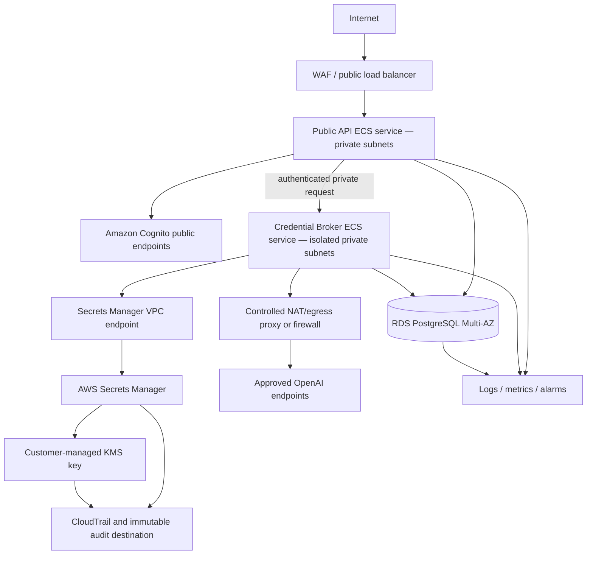

# BYOK AWS Architecture Design

## Document control

| Field | Value |
| --- | --- |
| Status | Draft for architecture, security, operations, and cost review |
| Target | Existing primary AWS region, Multi-AZ, no cross-region failover |
| Scale assumption | 1,000 workspaces, about 5,000 credentials, 100 concurrent provider requests |
| PRD basis | Sections 8, 9, 12–18 |
| Last updated | 2026-08-08 |

## Design principles

- Separate public API capabilities from secret retrieval and provider egress.
- Deny access by default and grant resource-scoped capabilities to workload identities.
- Keep tenant authorization in the application/database even when Cognito authenticates the user.
- Store secret values only in Secrets Manager; keep secret names and tags non-sensitive.
- Use infrastructure as code with reviewed plans and explicit apply approval.
- Separate development, staging, and production identities, data, secrets, KMS keys, logs, and state.
- Prefer failure with a safe error over fallback to an undisclosed credential or provider.

## Proposed topology



The exact WAF, egress firewall/proxy, service discovery, and immutable audit destination depend on the existing AWS platform and must be resolved in P0-09/P2-01.

## Proposed Terraform organization

Terraform is a Phase 2 deliverable and is not created or applied by this documentation task.

```text
infra/
  modules/
    network/
    cognito/
    kms/
    secrets-policy/
    rds/
    ecs-service/
    service-identity/
    egress-control/
    observability/
  environments/
    development/
    staging/
    production/
```

Requirements:

- Remote encrypted state with locking, separate state per environment, and tightly controlled state access.
- No secret values in Terraform variables, plans, state, outputs, tags, or resource names.
- Version constraints and provider/module changes reviewed through the dependency approval gate.
- A saved plan and cost/security review before every apply.
- Separate approval immediately before resource creation/change.
- Rollback and state-recovery procedure tested in staging.

## Network design

### Public API

- Only the load balancer/API ingress is internet-reachable.
- ECS tasks run without public IPs in private subnets across at least two Availability Zones.
- Inbound security groups allow only the load balancer to the application port.
- Outbound access is limited to required AWS services, Cognito/JWKS, internal broker, database, telemetry, and approved package/runtime needs determined at build time.

### Credential Broker

- No public IP, public load balancer, interactive debug endpoint, or direct user access.
- Inbound allows only the authenticated public API service path or approved internal gateway/service mesh identity.
- Secrets Manager and required AWS control-plane access use VPC endpoints where supported.
- Provider traffic leaves through a controlled egress path with HTTPS-only rules, DNS observability, redirect policy, and an approved hostname/port list.
- Arbitrary URLs, loopback, link-local, private-network ranges, cloud metadata endpoints, and user-controlled proxy settings are prohibited.

Provider hostname allowlisting must account for verified OpenAI endpoint behavior and be maintained operationally. IP-only allowlists are generally unsuitable for third-party cloud APIs whose addresses can change; the chosen egress control must securely validate DNS/hostname and TLS without trusting user input.

### Database

- RDS PostgreSQL Multi-AZ in isolated database subnets.
- No public accessibility.
- Inbound only from explicitly authorized application/broker security groups on the database port.
- TLS required and certificate validation configured.
- Application credentials stored in Secrets Manager and rotated through an approved database-secret lifecycle separate from customer provider keys.

## Workload identity and IAM capabilities

| Principal | Allowed | Explicitly absent/denied |
| --- | --- | --- |
| Public API task role | Required logs/metrics; Cognito/JWKS access as designed; database connectivity; invoke authenticated broker endpoint | `secretsmanager:GetSecretValue` for provider keys; `kms:Decrypt`; provider internet egress |
| Broker task role | Resource-scoped create/put/describe/get/delete/restore operations for BYOK secret namespace as required; safe logging/metrics; approved provider egress | Broad `secretsmanager:*`; unrelated secret access; arbitrary AWS admin; arbitrary internet egress |
| Migration task role | Schema migration connectivity for approved migration only | Provider secret retrieval; general application runtime use |
| Terraform deployment role | Reviewed resource-management actions for named environment | Persistent human use; runtime secret retrieval unless unavoidable and approved |
| Read-only operator | Safe health/metrics/log metadata | Secret values, unredacted bodies, database tenant data by default |
| Break-glass role | Time-bound, approved incident actions | Standing access; unaudited use |

Policy requirements:

- Scope provider secrets by ARN path/prefix and approved resource tags that contain only opaque identifiers.
- Restrict KMS use with key policy, workload principal, encryption context where practical, and `kms:ViaService` for Secrets Manager.
- Do not attach broad AWS managed read/write policies to runtime roles.
- Use short-lived task credentials; no long-lived AWS access keys in the service.
- Record IAM, Secrets Manager, and KMS control-plane actions in CloudTrail.
- Test denied actions using policy simulation and staging calls.

## KMS and Secrets Manager design

### KMS

- One customer-managed symmetric KMS key per environment initially; reassess per-tenant keys only for contractual requirements.
- Automatic key rotation enabled where organizational policy permits.
- Key administrators cannot automatically decrypt data; key-use and key-administration roles are separated.
- Key policy permits Secrets Manager use on behalf of the broker for the approved secret scope.
- Alarms cover key disablement, deletion scheduling, and abnormal decrypt/use patterns.

### Secrets Manager

- Opaque name pattern such as `byok/<environment>/<random-id>`; no organization name, workspace name, email, key prefix, provider account, or customer content.
- Secret value contains only the provider credential fields required by the adapter.
- Secret descriptions/tags contain only safe operational classification and opaque ownership identifiers.
- Customer key rotation is manual/atomic at the application level because the platform does not control provider-side key creation.
- No cross-request secret cache. Retrieve once per in-flight provider operation and limit plaintext scope.
- Disablement is enforced in PostgreSQL before retrieval.
- Deletion schedules a seven-day recovery window; permanent removal occurs after the window unless restored through an audited approved action.

AWS Secrets Manager uses envelope encryption under KMS, but secret names, descriptions, tags, and other metadata are not secret-value encryption boundaries. They must remain non-sensitive.

## PostgreSQL design controls

PostgreSQL stores users, organizations, workspaces, memberships, invitations, provider credential metadata/versions, provider and model catalog entries, workspace policies, audit events, and usage events.

Controls:

- UUID or equivalent non-sequential identifiers generated server-side.
- Tenant ownership represented through non-null foreign keys.
- Composite foreign keys or equivalent constraints prevent a child identifier from being rebound across workspaces.
- Partial unique constraint ensures at most one active credential per workspace/provider.
- Credential versions are immutable for the secret reference/value relationship.
- Row-level security is enabled and forced for tenant tables; application role is not table owner and lacks `BYPASSRLS`.
- Request transaction sets validated tenant/principal context using a design resistant to connection-pool leakage.
- Audit event mutation is prohibited to application roles; correction uses append-only events.
- No columns for prompts, audio bytes, transcripts, model responses, plaintext keys, authorization headers, or raw provider bodies.

The exact DDL and migrations require separate schema and migration approvals in Phase 1/3.

## Cognito design constraints

- Invite-only user onboarding; public self-sign-up disabled.
- Mandatory MFA with factors and recovery policy approved by security/product owners.
- Verify JWT signature from pinned/validated issuer JWKS and validate issuer, audience/client, token use, expiry/not-before, and required claims.
- Cognito identifies the user; PostgreSQL remains authoritative for organizations, workspaces, roles, invitation state, and provider policy.
- Do not trust mutable token attributes alone for tenant authorization.
- Use verified attributes for invitation/account binding and protect administrator APIs with least privilege.
- Decide one shared user pool versus stronger tenant isolation based on the actual enterprise boundary; the approved initial PRD assumes application-enforced tenancy and requires a Phase 0 review of that choice.

## Availability and scaling

- ECS desired count across at least two AZs for public API and broker.
- RDS Multi-AZ with connection pooling sized for 100 concurrent provider requests.
- Stateless application/broker tasks; no cross-request credential or content cache.
- Health checks distinguish process health from dependency readiness without exposing sensitive details.
- Timeouts and concurrency limits protect the broker and database from provider latency.
- Target 99.9% monthly availability and p95 platform overhead no greater than 250 ms, excluding provider latency.
- No cross-region failover in initial scope; document regional outage behavior honestly.

## Logging, audit, and alarms

Use field allowlists rather than attempting to redact arbitrary dumps after collection.

Safe correlation fields can include request ID, opaque user/workspace/credential identifiers, provider, catalog model ID, provider request ID, outcome/error category, usage, and latency.

Prohibited fields include credential value, authorization header, JWT, prompt, audio, transcript, response, raw request/response body, secret payload, connection string, and unreviewed exception serialization.

Minimum alarms:

- Authentication/MFA and authorization denial anomalies.
- Repeated validation/authentication failures by workspace/credential.
- Secret retrieval spikes or access by an unexpected principal.
- KMS denied/decrypt anomalies, key disablement, or deletion schedule.
- Cross-tenant/RLS policy test failures.
- Broker 5xx, latency, saturation, and provider outage/rate-limit rates.
- RDS availability, storage, connections, replication/failover, and backup failure.
- CloudTrail/log delivery failure and audit export integrity.

Audit events retain 12 months, operational logs 30 days, and encrypted RDS backups no more than 35 days, subject to confirmed organizational/legal requirements.

## Backup, restore, and deletion

- RDS automated backups encrypted with environment-approved KMS key, retention capped at 35 days.
- Restore test verifies RLS, application-role permissions, absence of credential values, and correct reference behavior.
- Secrets Manager deletion recovery is exercised in staging within the seven-day window.
- CloudTrail/audit export retention and immutability are tested independently of application database restoration.
- A restored database must not reactivate a credential whose secret was deleted/disabled after the backup; reconciliation behavior requires an explicit runbook and safe-default disablement.

## Environment isolation

| Environment | Data | Credentials | Access | Purpose |
| --- | --- | --- | --- | --- |
| Development | Synthetic only | Synthetic/mock only | Engineering | Unit/local integration |
| Staging | Synthetic tenants | Approved restricted staging provider key in Secrets Manager | Limited engineering/security | Integration, recovery, load, incident exercises |
| Production | Customer metadata/content in transit | Customer and approved platform credentials | Runtime roles and audited operators | Controlled release |

Never copy production secrets, customer content, database snapshots, or logs into development. Any sanitized production-derived dataset needs separate data approval.

## Cost and implementation gates

Before Phase 2 implementation, owners must approve:

- Region and account strategy.
- ECS task sizing/autoscaling and expected provider concurrency.
- RDS class/storage/backups and connection strategy.
- NAT/egress control cost and architecture.
- Secrets Manager credential/version count and API usage.
- KMS key/API usage, logging, CloudTrail, audit export, and alarm costs.
- Terraform state location and deployment role.

No Terraform apply, AWS resource modification, credential use, or deployment is authorized by this document.

## Sources

- [AWS Secrets Manager best practices](https://docs.aws.amazon.com/secretsmanager/latest/userguide/best-practices.html)
- [Secret encryption and decryption in AWS Secrets Manager](https://docs.aws.amazon.com/secretsmanager/latest/userguide/security-encryption.html)
- [Amazon Cognito multi-tenancy security recommendations](https://docs.aws.amazon.com/cognito/latest/developerguide/multi-tenancy-security-recommendations.html)
- [Amazon Cognito user-pool security best practices](https://docs.aws.amazon.com/cognito/latest/developerguide/user-pool-security-best-practices.html)
- [OWASP Secrets Management Cheat Sheet](https://cheatsheetseries.owasp.org/cheatsheets/Secrets_Management_Cheat_Sheet.html)
- [OWASP SSRF Prevention Cheat Sheet](https://cheatsheetseries.owasp.org/cheatsheets/Server_Side_Request_Forgery_Prevention_Cheat_Sheet.html)

Sources verified 2026-08-08. Implementation must reverify service behavior and policy syntax against current official documentation.
