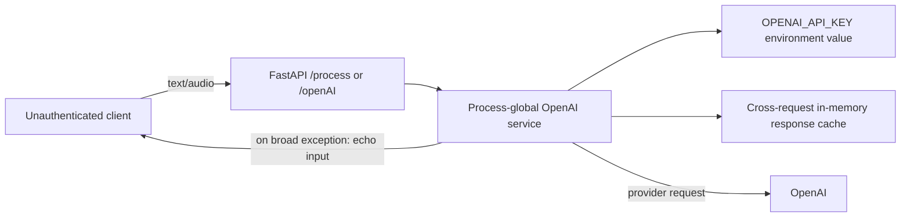
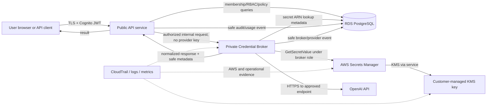

# BYOK Data Flow and Trust Boundaries

## Document control

| Field | Value |
| --- | --- |
| Status | Draft for architecture and security review |
| PRD basis | Sections 6, 8, 10–14 |
| Last updated | 2026-08-08 |

## Scope

This document describes the current unsafe prototype boundary and the approved target flow for authentication, credential management, provider invocation, auditing, and deletion. It is logical architecture; exact AWS resources and policies are defined in `byok-aws-design.md`.

## Sensitive assets

- Customer provider API key.
- Cognito token and authenticated identity.
- Organization/workspace membership and role.
- Credential metadata and secret ARN.
- KMS and IAM permissions.
- Prompt, audio, transient transcript, and provider response.
- Provider request ID, usage, outcome, and audit records.

## Current flow

Current risks:

- No authenticated tenant context or authorization.
- One global credential and client.
- Cross-request content cache with no tenant partition.
- Broad exception handling hides provider failure and returns user content.
- No durable tenant, policy, audit, or usage model.
- API service itself holds provider credentials.

These behaviors must not be reused in the new `/v1` flow.

## Target component flow

## Trust boundaries

| Boundary | Untrusted side | Trusted side | Required controls |
| --- | --- | --- | --- |
| TB-1 Client to public API | Browser/mobile/API caller | API ingress | TLS, size limits, schema validation, request ID, no body logging |
| TB-2 Identity to application | JWT claims | Authenticated principal | Signature, issuer, audience/client, expiry, token use, MFA, revocation/disable policy |
| TB-3 Application to tenant data | User-supplied IDs | Workspace-scoped records | Membership lookup, RBAC, policy, foreign keys, RLS, deny by default |
| TB-4 API to broker | General application workload | Credential-capable workload | Private networking, workload identity, authenticated request, least privilege, replay controls |
| TB-5 Broker to secret store | Secret reference | Plaintext credential | Resource-scoped IAM, KMS conditions, TLS, CloudTrail, no cross-request cache |
| TB-6 Broker to provider | Internal normalized request | External OpenAI endpoint | Endpoint allowlist, TLS, controlled DNS/redirects, timeouts, content/usage policy |
| TB-7 Workload to telemetry | Runtime objects | Logs/metrics/audit | Field allowlist, redaction, no body/header dumps, immutable export |

## Credential creation flow

1. Authenticated owner or workspace administrator opens the credential form.
2. The client prevents analytics/session replay on the form and holds the key only in memory.
3. The client submits the key over TLS to the write-only credential endpoint.
4. The public API validates token, MFA requirement, workspace membership, role, input bounds, and provider/model policy before forwarding.
5. The API forwards the credential through a private authenticated channel to the broker without logging the body.
6. The broker creates an opaque Secrets Manager secret under the approved KMS key.
7. PostgreSQL stores tenant ownership, provider, secret ARN, masked fingerprint metadata, state, timestamps, and version—never the value.
8. The broker performs the disclosed minimum validation for each enabled capability.
9. A successful validation activates the new credential atomically; a failed replacement leaves the existing active version unchanged.
10. The API returns metadata and status only. Audit events record the actor and outcome, not the key.

## Invocation flow

1. Client calls `/v1/workspaces/{workspace_id}/process` with JWT, provider, catalog model ID, request ID/idempotency data, and transient content.
2. API validates authentication, MFA, membership, role/capability, workspace policy, model allowlist, and request limits.
3. API selects an explicitly permitted credential source. Absence/failure is an error; no implicit fallback occurs.
4. API sends the broker an authenticated internal request containing safe principal/workspace/policy context and transient content, but no secret value.
5. Broker rechecks the credential-to-workspace/provider binding and active state.
6. Broker retrieves the secret exactly once for the in-flight request, creates a request-scoped provider client, and invokes only the approved OpenAI endpoint.
7. Broker normalizes provider output, usage, request ID, and errors; it releases references after the request.
8. API returns the result and records only allowlisted operational/audit metadata.
9. Prompt, audio, transcript, response, authorization header, and provider key are not persisted.

## Rotation, disablement, and deletion

### Rotation

- Create a new secret version without changing the active reference.
- Validate it using disclosed minimal calls.
- In one database transaction, activate the new metadata version and deactivate the previous version.
- If validation or the transaction fails, retain the previous active version.
- Never reuse plaintext or return the prior value.

### Disablement

- Commit the disabled state in the authoritative database immediately.
- Reject new retrieval/invocation before Secrets Manager access.
- In-flight requests follow the approved cancellation/consistency policy and are audited.

### Deletion

- Disable immediately.
- Schedule Secrets Manager deletion with a seven-day recovery window.
- Retain tombstone/audit metadata according to policy without retaining plaintext.
- Database and log deletion do not promise immediate removal from encrypted backups; backup expiry is at most 35 days.

## Data classification and persistence

| Data | Classification | Persistent location | Retention |
| --- | --- | --- | --- |
| Provider key | Restricted secret | Secrets Manager only | Active lifecycle plus seven-day deletion recovery |
| Secret ARN and masked metadata | Confidential tenant metadata | PostgreSQL | Account/lifecycle policy |
| Prompt/audio/transcript/response | Restricted transient content | None in platform | Request lifetime only |
| JWT | Restricted authentication material | None | Request lifetime only |
| Provider request ID and usage | Confidential operational metadata | PostgreSQL/telemetry | Approved usage/audit policy |
| Credential/audit event | Confidential security evidence | PostgreSQL + immutable export | 12 months |
| Operational logs | Confidential operational evidence | Approved log service | 30 days |
| RDS backups | Encrypted recovery data | AWS backup storage | No more than 35 days |

## Open review questions

- Exact service-to-service authentication mechanism between API and broker.
- Existing AWS region, accounts, DNS/egress implementation, and centralized logging services.
- Whether request cancellation is required in the initial non-streaming contract.
- Exact audit export destination and immutability control.
- Provider data-control configuration and permitted OpenAI endpoints/models for staging and production.

These questions must be resolved before their related Phase 1–3 tasks, not guessed by implementation AI.
